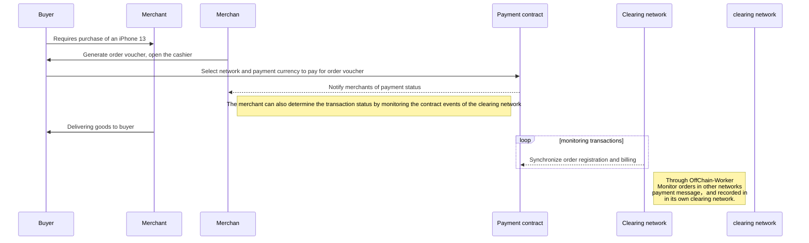
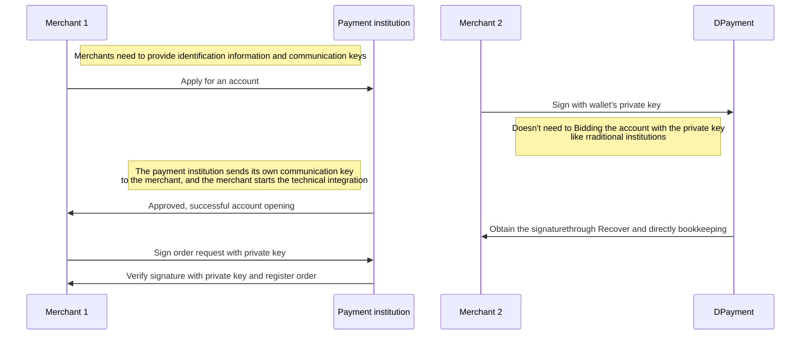

title: DPayment on Acala-Hackathon 
speaker: Five
js:
    - https://kit.fontawesome.com/f1d620f06d.js
prismTheme: dark
plugins:
    - echarts
    - mermaid

<slide class="bg-apple aligncenter" image="https://source.unsplash.com/n9WPPWiPPJw/">

## DPayment Protocol

Acala Hackathon

By Five {.text-intro}

[:fa-github: Github](https://github.com/nulls-network){.button.ghost}

<slide :class="size-50" class="bg-black">
### Vision：Provide universal payment services for users and merchants
### Core: Blockchain-based decentralized payment network 
## Project Name：DPay Payment System

<slide :class="size-50" class="bg-black" >
## 24 hour usage statistics for Stablecoins
Major stablecoin transactions on mainstream blockchain networks

| Network | Token type | Number of transactions(24h) |  Volume of transactions（24h） |
| :----------- | :------------: |:------------: | ------------: |
| [tron.network](https://tronscan.org/)  | Tether USD | 1,887,378 | $50,999,484,858 |
|                                        | USD Coin | 13,779 | $1,298,415,223 |
| [ethereum](https://etherscan.io/tokens) | Tether USD | 182,984 | $33,199,630,474 |
|                                        | USD Coin | 156,080 | $43,021,260,994 |
|                                        | BSC USD | 4886 | $4,360,316,344 |
| [BSC Mainnet](https://bscscan.com/tokens) | BSC USD | 250,571 | $7,407,738,984 |
|                                    | USD Coin | 156,217 | $2,309,950,299 |

<slide :class="size-70" class="bg-black" >

#### Why is there such a large difference in stablecoin tx volume between the Tron and other networks?
#### Where do these txs come from? {.text-content}

--- 

### 1. USDT is being used as currency for floor and OTC trading. 
### 2. The tx cost is close to 0.
### 3. They are widdly used in traditional payment scenarios.
### 4. A considerable amount of transaction volumes in centralized payment systems are left to be captured. 

<slide :class="size-80" class="bg-black" image="https://webslides.tv/static/images/iphone-hand.png .right-bottom">

:::{.content-left}

### Use cases for digital currencies

:::flexblock {.specs}
::fa-solid fa-arrow-down-up-across-line::

## Defi & Asset transfer

Blockchain users execute on-chain transactions and transfer assets between exchanges and wallets.

---

::fa-solid fa-earth-americas::

## Cross-border trade

Online e-commerce(Tiktok/Shopify etc), parallel to PayPal.

---

::fa-solid fa-film::

## Entertainment industry

Video/live broadcast/Game: Avoid policy restrictions in different regions.

---

::fa-solid fa-money-bill-transfer::

## Cross-border settlement

Video/live/competition, Avoid policy restrictions in different regions.

:::

<slide :class="size-60" class="bg-black">

### ::fa-solid fa-cube:: How to create a payment system for digital currency by DPayment?

DPayment's goal is to create a decentralized payment system that follows the Web3 specifications. {.text-intro}

* :WEB3 Specifications\::{.text-label} Easy usage for users and merchants with just one wallet.
* :Abstract complexity\::{.text-label}  Easy accessible SDKs for developers and user-friendly front-end for users without knowing the intricate underlying layers.
* :Run without trust\::{.text-label} Smart contracts and other trusted technologies to ensure the functioning with minimum trust.
* :Motivation and Safety\::{.text-label} Strong economic incentives for nodes to operate reliably and accurately.
* :Reliable performance\::{.text-label} SubStrate-based Layer2 for reliable performance[(_***Performance Report Link***_)](https://github.com/nulls-network/chain-loadtest).
* :Big data service\::{.text-label} Indexing service built by the founding team for developers and merchants to build and use.
* :Developer community\::{.text-label} Improving products and expanding product boundaries by injecting incentives into the community.
{.description}

<slide :class="size-60" class="bg-black">
## Integration with Acala 
DPayment accepts payments from multiple blockchain networks. Once the payment is received in the non-clearing chain, equivalent assets on the clearing chain will be minted for accounting using a cross-chain mechanism. In the early stages of the system, only stable coins such as USDT/USDC/DAI/BUSD on different networks are supported as settlement currencies.
But tokens with LP Pair on the payment chain are supported as payment currencies. DPayment will register the transaction on the clearing chain after it successfully receives the payment, and mint the equivalent DP-USD assets for merchant settlement.

:::shadowbox
## Powering the Acala Network.
The Acala network was utilized as the clearing network in the beginning. DPayment will use the Acala network for bookkeeping and registering the cash flow, and merchants will use the Acala network for asset management. DPayment's Callback mode can also offer a variety of usage scenarios to the Acala network.
（[IDO Demo](https://opendao.dev)）。

---

## StableCoin - aUSD
DP-USD is a Wrapper Token for Stablecoins, and the reserve assets in other networks are issued 1:1. After receiving DP-USD, merchants can withdraw StableCoins of equivalent value through withdrawal and payment operations, such as USDT/USDC/BUSD/DAI in other networks.
Because aUSD has a better credit endorsement, we can replace DP-USD as a settlement asset to enhance the DPayment settlement fund guarantee and provide usage scenarios for aUSD's liquidity.

:::

<slide :class="size-70 bg-white" class="bg-black" >
## Payment process {.aligncenter}


<slide :class="size-80 bg-white" class="bg-black" >
## Changes in the way you use Web3 {.aligncenter}
Traditional payment: Symmetric signature usually uses the MD5 algorithm, and symmetric encryption uses the DES and AES algorithms. Asymmetric signature and encryption use the RSA algorithm system.



<slide :class="size-80" class="bg-black">

:::column {.vertical-align}
## **`Security` and `Convenience` of orders**

The merchant signs the order to be completed through the private key in the form of `EIP-191` to obtain the order proof. The order proof contains the token type and amount of the target payment.

Users can use this proof to make payment in the network supported by Dpayment. The validity of the order is determined by the contract. After successful payment, an on-chain order event is generated in the payment network.

The Dpayment clearing network will clear and settle for merchants according to the order proof and payment information submitted by `OffChain-Worker`.

----
```JSON
{
    "orderNo": "0x64373931393335372d356438312d343461662d386438362d3735383437636500",
    "token": "0x1111222233334444555566667777888899990000",
    "chainId": "1",
    "amount": "1000000000000000000",
    "to": "0x8aA2947fbf2ED842526C289a92aaFdbB8c5356AF",
    "deadline": "10000000000000",
    "cross": "1",
    "v": "27" ,
    "r": "0xd3ddb8552cce732567d162952dc4665561a96430e1c9c1e5298560b77f867eeb",
    "s": "0x63ec5edd5d1de8a6de82b22f16fe806f03442393a492b70b3e134ab2acc2a14e",
    "rawToken": "0x",
    "callback": "0x65C654f01e6BE4B2c22B456EEb972D86c78DFba1",
    "productName": "NWS IDO",
    "productDes": "NWS IDO"
}
```
:::

---
**`After the user has approved the Dpayment contracts, the user can sign the payment request offline and the middleman will pay the on-chain gas. `**{.alignleft}

<slide :class="aligncenter size-80" class="bg-black">

## DPayment TODO-List

----
- [::fa-check-double::] Payment core
  - [:fa-check:]Account
  - [:fa-check:]Accounting cash flow
  - [:fa-check:]Withdrawal / Payment
- [:fa-check:] Cashier
- [:fa-check:] Merchant backend
  - [:fa-check:]Account management
  - [:fa-check:]Deposit / withdrawal
  - [:fa-check:]Order / Cash flow
  - [:fa-horizontal-rule:]Operational data analysis

* [:fa-check:]Developer tools
  * [:fa-horizontal-rule:]SDK
  * [:fa-check:]Debugger tools
* [:fa-check:]Indexing Service
  * [:fa-horizontal-rule:]Data repositories
  * [:fa-horizontal-rule:]JSON-RPC
* [:fa-check:]Governance
  * [:fa-horizontal-rule:] Economic model
  * [:fa-check:] OffChain-Worker
  * [:fa-horizontal-rule:] Node management

+ [:fa-horizontal-rule:]Extended protocol
  + [:fa-horizontal-rule:]Multi-sign contracts for merchants
  + [:fa-horizontal-rule:]Agent contract
  + [:fa-horizontal-rule:]Destroy super permissions
+ [:fa-check:]Market promotion
  + [:fa-check:]Pilot merchants
  + [:fa-horizontal-rule:]Advertising
+ [:fa-check:]Financing history
  + [:fa-check:]Angel round
  + [:fa-horizontal-rule:]Seed round

<slide class="bg-black-blue">
## Introduction of the core team
:::column

### **:fa-graduation-cap: Johnson**

Head of Search Division at Yahoo China<br />
Head of South China Region at Baidu Search Division <br />
Head of Marketing&Payment Division at Huifu World. <br />
Co-founder - responsible for investment, financing and overall operations。

---
### **::fa-solid fa-user-graduate:: Johnathan**

Ph.D of Beihang University <br/>
Research areas involve consensus algorithms, blockchain architecture and Defi.<br />
Head of the Beihang University' Blockchain Association. <br/>
Former engineer at Beijing Sogou Technology <br />
Organized and planned the Near China tour and the Conflux community seminar.<br />
Co-founder - responsible for product and community building.

---
### **::fa-solid fa-user-ninja:: Five**

Ten years of technology experience, seven years of payment/Internet development experience, and three years of blockchain development experience. <br />
Worked for Hi Sun Group, Hundsun Electronics, and Tencent, among others, and has extensive entrepreneurial experience.<br/>
Co-founder - primarily responsible for DPayment technology and product development.

---
### **::fa-solid fa-user-tie:: Colin**

Head of offline payment business at Hi Sun Group. <br />
Tianjin Branch Manager, North China Region Operations Director, and Operation director of group business division at Suxingfu Payment Company. <br />
COO of Shangyinxin Payment Company.  <br />
Multiple entrepreneurial experience. <br />
Co-founder - responsible for the brand development.

---
:::


<slide class="bg-black aligncenter" image="https://source.unsplash.com/RSOxw9X-suY/">

## We don't make history, we just follow the trend. {.animated.tada}

When **Visa** 和 **Master** announced deny of service for ordinary Russian users, **DPayment** 's opportunity is coming! {.text-into.animated.delay-800.fadeIn}

[::fa-solid fa-tornado:: DPay.System](https://dpay.systems){.button.animated.delay-1s.fadeInUp}