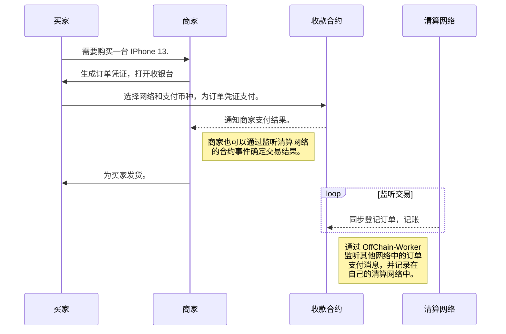
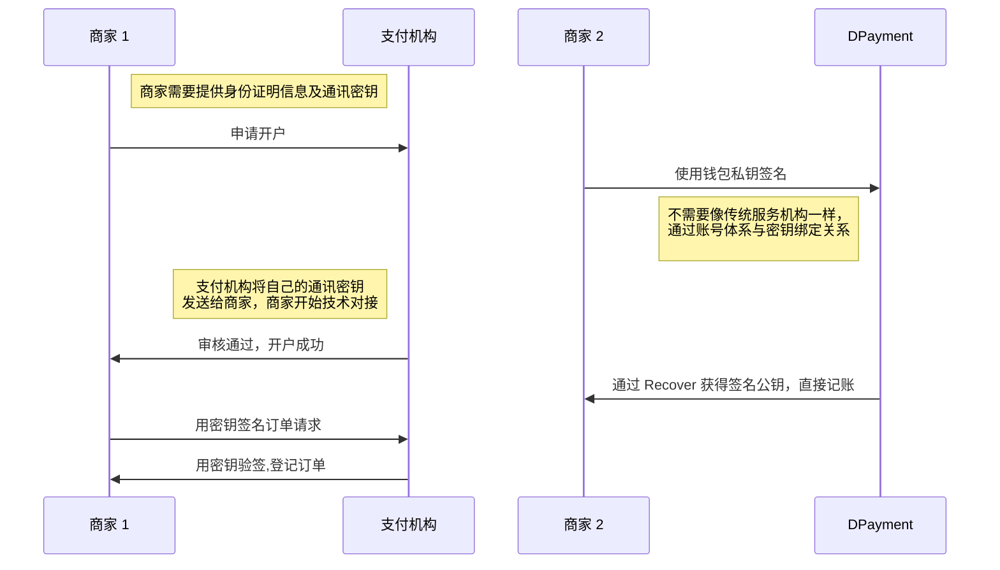

title: DPayment on Acala-Hackathon 
speaker: Five
js:
    - https://kit.fontawesome.com/f1d620f06d.js
prismTheme: dark
plugins:
    - echarts
    - mermaid

<slide class="bg-apple aligncenter" image="https://source.unsplash.com/n9WPPWiPPJw/">

## DPayment Protocol

Acala Hackathon

By Five {.text-intro}

[:fa-github: Github](https://github.com/nulls-network){.button.ghost}

<slide :class="size-50" class="bg-black">
### 愿景：为用户和商家提供通用支付服务
### 基础：基于区块链搭建的去中心支付网络
## 简称：DPay 支付系统

<slide :class="size-50" class="bg-black" >
## 稳定币 24 小时使用统计
不同网络中常见稳定币的交易数据

| 网络 | Token 类型 | 交易笔数(24h) | 交易总量（24h） |
| :----------- | :------------: |:------------: | ------------: |
| [tron.network](https://tronscan.org/)  | Tether USD | 1,887,378 | $50,999,484,858 |
|                                        | USD Coin | 13,779 | $1,298,415,223 |
| [ethereum](https://etherscan.io/tokens) | Tether USD | 182,984 | $33,199,630,474 |
|                                        | USD Coin | 156,080 | $43,021,260,994 |
|                                        | BSC USD | 4886 | $4,360,316,344 |
| [BSC Mainnet](https://bscscan.com/tokens) | BSC USD | 250,571 | $7,407,738,984 |
|                                    | USD Coin | 156,217 | $2,309,950,299 |

<slide :class="size-70" class="bg-black" >

#### 为什么Tron网络中的稳定币体量与其他网络有如此大的差距？
#### 这些交易来自何处？ {.text-content}

--- 

### 1. USDT 正在被场内和场外作为货币来使用
### 2. 使用成本更低甚至接近为 0
### 3. 大量应用于传统支付场景中
### 4. 大量用于中心化支付系统中的交易数据未能捕获 

<slide :class="size-80" class="bg-black" image="https://webslides.tv/static/images/iphone-hand.png .right-bottom">

:::{.content-left}

### 数字货币使用场景

:::flexblock {.specs}
::fa-solid fa-arrow-down-up-across-line::

## Defi & 资产调拨

区块链玩家链上交易，不同交易所和钱包间调拨资产。

---

::fa-solid fa-earth-americas::

## 跨境贸易

Tiktok/Shopify 等线上电商，并行于 PayPal。

---

::fa-solid fa-film::

## 娱乐行业

视频/直播/竞技，规避全球不同地区的政策限制。

---

::fa-solid fa-money-bill-transfer::

## 跨境结算

视频/直播/竞技，规避全球不同地区的政策限制。

:::

<slide :class="size-60" class="bg-black">

### ::fa-solid fa-cube:: DPayment 是如何做数字货币支付系统的？

DPayment 的理想是建设一套符合 Web3 规范的去中心化支付系统。{.text-intro}

* :WEB3 规范\::{.text-label} 商家和用户通过一个钱包即可开始使用。
* :抽象复杂性\::{.text-label} 开发者和用户无需理解复杂的底层，即可通过 SDK 或前端产品使用该协议。
* :无信任运行\::{.text-label} 通过智能合约和其他可信技术保障最低信任的运行。
* :激励及安全\::{.text-label} 确保节点具有强大的经济动机来保证面对足够大的作弊诱惑时可靠和正确的运行。
* :可靠的性能\::{.text-label} 基于 SubStrate 建设 Layer2 提供核心处理性能[（_***性能报告传送门***_）](https://github.com/nulls-network/chain-loadtest) 。
* :大数据服务\::{.text-label} 早期由创始团队建设索引服务，开发者和商家通过该服务构建和使用系统。
* :开发者社区\::{.text-label} 为社区注入激励，由社区驱动，完善产品和扩展产品边界。
{.description}

<slide :class="size-60" class="bg-black">
## 与 Acala 生态的结合
DPayment 支持多网络支付，在非清算链收款后，会通过跨链的方式，在清算链上Mint等值资产用于记账。为降低系统初期的建设难度，仅支持不同网络中的 USDT/USDC/DAI/BUSD 等稳定币作为收款货币，
但支付可支付在付款链上有 LP Pair 的 Token 。通常 DPayment 完成收款后，会在清算链上登记交易，Mint 出等值的 DP-USD 资产为商家提供结算。

:::shadowbox
## 为 Acala 网络提供活力.
早期使用 Acala 网络作为清算网络，DPayment 将使用 Acala 网络用于记账和登记流水，商家也会通过 Acala 网络管理账户内的资产。DPayment 的 Callback 模式，也可以为 Acala 网络带来丰富的使用场景
（[IDO Demo](https://opendao.dev)）。

---

## StableCoin - aUSD
DP-USD 是一种 StableCoin 的 Wrapper Token ，于其他网络中的备付金资产是 1：1 发行。商家收到 DP-USD 后，可通过提现和付款操作，在其他网络中取出等值的 USDT/USDC/BUSD/DAI 等 StableCoin 。
由于 aUSD 有更高的信用背书，可以替代 DP-USD 作为结算资产，增加 DPayment 结算资金担保的同时，为 aUSD 提供流动性使用场景。

:::

<slide :class="size-70 bg-white" class="bg-black" >
## 支付流程 {.aligncenter}


<slide :class="size-80 bg-white" class="bg-black" >
## 使用 Web3 的方式带来的改变 {.aligncenter}
传统支付：对称签名通常使用 MD5 算法, 对称加密使用 DES 和 AES 算法。非对称使用 RSA 算法体系。



<slide :class="size-80" class="bg-black">

:::column {.vertical-align}
## **订单的`安全性`和`便捷性`**

商家通过私钥对期望完成收款的订单进行签名，使用`EIP-191`的方式签名，得到订单证明。订单证明包含了目标收款的货币类型及金额。

用户可以使用该证明，在 DPayment 支持的网络中进行支付。订单的有效性由合约判断，支付成功后在支付网络中生成订单事件。

DPayment 清算网络上会根据 `OffChain-Worker` 提交的订单证明和支付信息为商户清结算。

----
```JSON
{
    "orderNo": "0x64373931393335372d356438312d343461662d386438362d3735383437636500",
    "token": "0x1111222233334444555566667777888899990000",
    "chainId": "1",
    "amount": "1000000000000000000",
    "to": "0x8aA2947fbf2ED842526C289a92aaFdbB8c5356AF",
    "deadline": "10000000000000",
    "cross": "1",
    "v": "27" ,
    "r": "0xd3ddb8552cce732567d162952dc4665561a96430e1c9c1e5298560b77f867eeb",
    "s": "0x63ec5edd5d1de8a6de82b22f16fe806f03442393a492b70b3e134ab2acc2a14e",
    "rawToken": "0x",
    "callback": "0x65C654f01e6BE4B2c22B456EEb972D86c78DFba1",
    "productName": "NWS IDO",
    "productDes": "NWS IDO"
}
```
:::

---
**`当用户对 DPayment 的合约 Approved 后，用户可以离线签名支付请求后，由中间人承担支付 Gas 上链.`**{.alignleft}

<slide :class="aligncenter size-50" class="bg-black">

## DPayment TODO-List

----
- [::fa-check-double::] 支付核心
  - [:fa-check:]账户
  - [:fa-check:]会计流水
  - [:fa-check:]提现/付款
- [:fa-check:] 收银台
- [:fa-check:] 商户后台
  - [:fa-check:]账户管理
  - [:fa-check:]充值/提现
  - [:fa-check:]订单/流水
  - [:fa-horizontal-rule:]运营数据分析

* [:fa-check:]开发者工具
  * [:fa-horizontal-rule:]SDK
  * [:fa-check:]调试工具
* [:fa-check:]索引服务
  * [:fa-horizontal-rule:]数据仓库
  * [:fa-horizontal-rule:]JSON-RPC
* [:fa-check:]社区治理
  * [:fa-horizontal-rule:] 经济模型
  * [:fa-check:] OffChain-Worker
  * [:fa-horizontal-rule:] 节点管理

+ [:fa-horizontal-rule:]扩展协议
  + [:fa-horizontal-rule:]商家多签合约
  + [:fa-horizontal-rule:]代理商合约
  + [:fa-horizontal-rule:]销毁超级权限
+ [:fa-check:]市场推广
  + [:fa-check:]试点商户
  + [:fa-horizontal-rule:]宣传资料
+ [:fa-check:]融资情况
  + [:fa-check:]天使轮
  + [:fa-horizontal-rule:]种子轮

<slide class="bg-black-blue">
## 核心团队介绍
:::column

### **:fa-graduation-cap: Johnson**

雅虎中国区搜索事业部主要负责人；<br />
百度搜索事业部华南区负责人; <br />
汇付天下支付事业部市场负责人。 <br />
作为联合创始人，负责投融资及整体运营。

---
### **::fa-solid fa-user-graduate:: Johnathan**

北京航空航天大学博士；<br/>
北京航空航天大学区块链协会负责人；<br/>
BTCU 区块链技术社区核心发起人;<br />
研究领域主要涉及共识算法、区块链架构和 Defi。<br />
曾组织策划Near中国行，Conflux高效社区宣讲会。<br />
作为联合创始人，负责产品和社区建设。

---
### **::fa-solid fa-user-ninja:: Five**

十年老技术，7 年支付/互联网开发经验，3 年区块链开发经验。<br />
曾就职于高阳集团/恒生电子/腾讯等企业，并拥有多次创业经验。<br/>
作为联合创始人，主要负责 DPayment 技术和产品相关工作。

---
### **::fa-solid fa-user-tie:: Colin**

高阳集团中国移动和包线下支付会生活业务负责人；<br />
随行付支付公司天津分公司负责人、华北区运营主管、集团事业部运营总监；<br />
商银信支付公司 COO。<br />
拥有多次创业经验。<br />
作为联合创始人，负责品牌运营。

---
:::


<slide class="bg-black aligncenter" image="https://source.unsplash.com/RSOxw9X-suY/">

## 我们不会创造历史，只是顺应潮流。{.animated.tada}

当 **Visa** 和 **Master** 宣布对俄罗斯普通民众停止服务的那一刻开始，**DPayment** 的机会来了！ {.text-into.animated.delay-800.fadeIn}

[::fa-solid fa-tornado:: DPay.System](https://dpay.systems){.button.animated.delay-1s.fadeInUp}